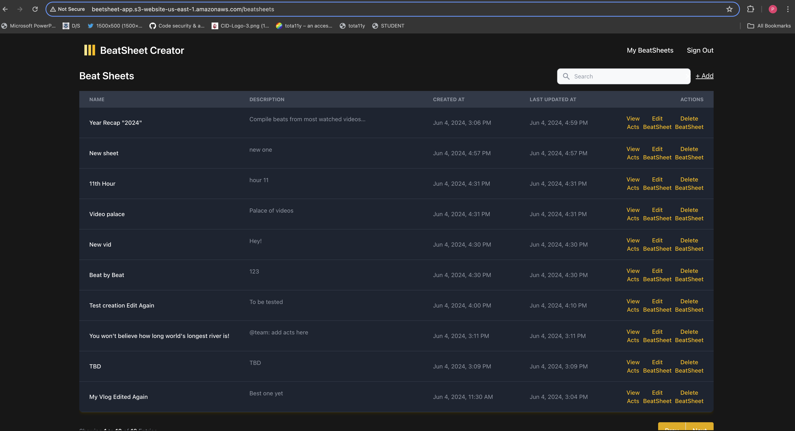

# BeatSheet Creator Application

## Candidate: Pooja Mule (poojamules95@gmail.com)

## Table of Contents
- [Links](#links)
- [Usage Instructions](#usage-instructions)
- [Features](#features)
- [Bonus Features](#bonus-features)
- [Assumptions](#assumptions)
- [UI Considerations](#ui-considerations)
- [Technologies Used](#technologies-used)

### Links
- Deployed Application Website http://beetsheet-app.s3-website-us-east-1.amazonaws.com
- Github Repository: https://github.com/PoojaVM/beatsheet-manager

###  Usage Instructions
1. Website is hosted using AWS and can be accessed using [this link](http://beetsheet-app.s3-website-us-east-1.amazonaws.com)
2. To run application locally, follow the instructions below
    - Prerequisite
        - Node.js
        - npm
        - git
    - Clone the repository using command "git clone [repo link](https://github.com/PoojaVM/beatsheet-manager)"
    - Postgres setup
        - Ensure you have database named `postgres ` running on port `5432`
        - Refer to `.env.example` file and create a `.env` file with the required environment variables
    - Server setup
        - Navigate to the server directory using command "cd server"
        - Install dependencies using command "npm install"
        - Start the server using command "npm start"
    - Migrations and seeding
        - Migration and seeding can be done using the following commands
            - `npm run migrate:up`
            - `npx run seed`
        - To revert the migration, run the following command 3 times
            - `npm run migrate:down`
    - Client setup
        - Navigate to the client directory using command "cd client"
        - Install dependencies using command "npm install"
        - Start the application using command "npm start"
    - Open the browser and visit `http://localhost:3000` and sign up using gmail to access the application
4. Login credentials
    - User with existing beatsheets
        - Username: `poojamules95`
        - Password: `Test@123`
    - New user
        - Username: `spotter`
        - Password: `Test@123`

### Features
1. Authentication
    - AWS Cognito is used for authentication
    - To sign up, use a valid email address, a unique username, and password
    - User can sign up, sign in, reset password, and sign out
2. Routing
    - Routing is protected and user is redirected to login page if not authenticated
    - User is redirected to `beetsheets` page if already authenticated
    - User can view and edit each beatsheet by clicking on the respective row and the route changes accordingly
3. Welcome Screen
    - User is shown a welcome message upon login
4. List Beatsheets
    - Users are shown a list of beatsheets post welcome message
    - The beatsheets are sorted by the last updated date
    - Search functionality is provided to search for beatsheets by name or description
    - Each row shows the beatsheet name, description, created date, and last updated date
    - User can click on the action items in the row to view and edit the beatsheet
    - List beatsheet example is shown below
        
5. Beatsheet actions
    - Add new beatsheet
    - Edit beatsheet
    - Delete beatsheet
6. Act actions
    - Add new act
    - Edit act
    - Delete act
7. Beats actions
    - Add new beat
    - Edit beat
    - Delete beat

### Bonus Features
1. AWS hosting
2. Animations
3. Beatsheet deletion and pagination
4. Reorder acts (drag and drop acts) 
5. Reorder beats (moving beats in same act and across acts)
6. Responsive design
7. User session management

### Assumptions
1. User can only view and edit their own beatsheets

### UI Considerations
1. Styling is done using Tailwind CSS
2. The UI is responsive and works well on most of the screens
3. Validations are done on the client side and the user is shown an error message if the input is invalid
4. Acknowledgement message is shown on successful actions like adding, editing, and deleting beatsheets, acts, and beats
5. Drag and drop functionality is provided to reorder acts and beats using react-beautiful-dnd library

### Technologies Used
1. React
2. Node.js
3. Express
4. Postgres
5. AWS Cognito
6. Tailwind CSS
8. AWS Elastic Beanstalk
9. AWS S3
